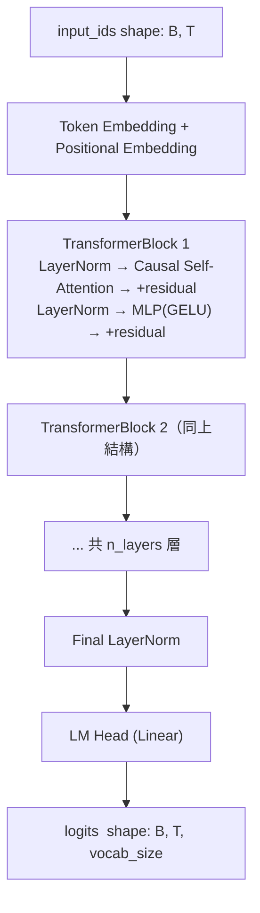
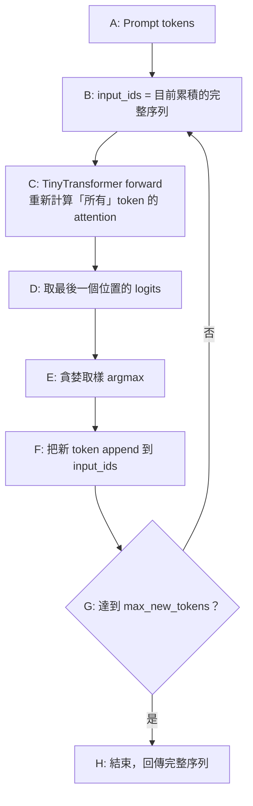

# Stage 0：樸素 Baseline（無 KV Cache 的生成迴圈）

## 這階段要解決的問題

推論一個 decoder-only 語言模型時，最直覺、也最笨的做法是：
**每次要生一個新 token，就把「目前為止的整個序列」重新丟進模型跑一次 forward。**

這樣做在「正確性」上完全沒問題（每次都是重新算，不會算錯），
但在「效率」上有一個根本缺陷：第 *t* 步時，模型要重新計算
前面 *t-1* 個 token 的 attention/Q/K/V，即使這些數值在前一步
早就算過一模一樣的結果。

這一階段的目標**不是**解決這個問題（那是 Stage 1 KV cache 的工作），
而是：

1. 先做出一個正確、簡單、可測試的版本，作為之後所有優化的
   **正確性對照組**（之後不管怎麼優化，輸出都必須跟這版一致）。
2. 親手量測、感受這個「O(n²)」問題到底長什麼樣子。

## 架構：迷你 Transformer

刻意手刻每一層（不用 `nn.TransformerEncoder`），因為之後階段
要深入修改 attention 內部（換成 KV cache、換成 block-based
PagedAttention），用高階封裝反而會擋路。



**關鍵形狀**（`hidden_dim=128, n_heads=4` 時，`head_dim=32`）：

| 步驟 | Tensor shape |
|---|---|
| 輸入 | `[B, T]` |
| Embedding 後 | `[B, T, hidden_dim]` |
| QKV 投影後（拆頭前）| `[B, T, 3*hidden_dim]` |
| 拆多頭後 | `[B, n_heads, T, head_dim]` |
| Attention scores | `[B, n_heads, T, T]` |
| Attention 輸出（合併多頭後）| `[B, T, hidden_dim]` |
| 最終 logits | `[B, T, vocab_size]` |

## 架構：樸素生成迴圈



**這張圖裡最重要的一格是 C**：每次繞回 B 再進 C 時，
`input_ids` 只比上一輪多了 1 個 token，但 forward 卻是把
**全部**重新算一次 —— 這就是 Stage 1 要拿掉的浪費。

### 問題說明

我們用生成文字 "A" -> "B" -> "C" 的過程，來看看這個模型到底「笨」在哪裡：

#### 圈數 1：輸入 "A"（序列長度 T = 1）

模型只拿到 1 個字。

```bash
【輸入】: ["A"]

1. 算 QKV : qkv_proj("A") ─> 得到 Q1, K1, V1
2. 算 Attention Scores :
   [ Q1@K1 ]  <-- (1x1 矩陣)

【結果】: 預測下一個字是 "B"
```

#### 圈數 2：輸入 "A", "B"（序列長度 T = 2）

因為沒有記憶 (KV Cache)，模型必須把 ["A", "B"] 當成全新輸入。

```bash
【輸入】: ["A", "B"]

1. 算 QKV : 
   qkv_proj("A") ─> 得到 Q1, K1, V1  <-- 💥 浪費！A 在圈數 1 早算過，這裡完全重算！
   qkv_proj("B") ─> 得到 Q2, K2, V2

2. 算 Attention Scores :
   ┌───────┬───────┐
   │ Q1@K1 │ Q1@K2 │  <-- 💥 (Q1@K1) 在圈數 1 也早就算過了！
   ├───────┼───────┤
   │ Q2@K1 │ Q2@K2 │
   └───────┴───────┘
   (2x2 矩陣，重新算了 4 個格子的關係)

【結果】: 預測下一個字是 "C"
```

### 圈數 3：輸入 "A", "B", "C"（序列長度 T = 3）

到了這一步，浪費情況更加嚴重：

```bash
【輸入】: ["A", "B", "C"]

1. 算 QKV : 
   qkv_proj("A") ─> 得到 Q1, K1, V1  <-- 💥 第 3 次重複計算！
   qkv_proj("B") ─> 得到 Q2, K2, V2  <-- 💥 第 2 次重複計算！
   qkv_proj("C") ─> 得到 Q3, K3, V3

2. 算 Attention Scores :
   ┌───────┬───────┬───────┐
   │ Q1@K1 │ Q1@K2 │ Q1@K3 │ 
   ├───────┼───────┼───────┤ ───> 虛線左上角這塊 (2x2)
   │ Q2@K1 │ Q2@K2 │ Q2@K3 │      完全是圈數 2 算過一模一樣的東西！
   ├───────┼───────┼───────┤
   │ Q3@K1 │ Q3@K2 │ Q3@K3 │
   └───────┴───────┴───────┘
   (3x3 矩陣，重新算了 9 個格子的關係)

【結果】: 預測下一個字是 "D"
```

## 為什麼這樣很慢？

- 舊字重複算：每次傳進去的 input_ids 長度都是 T。模型沒有任何記憶體（Cache），所以過去的每個字都要重新經過 qkv_proj 線性層投影。  
- 關係重複算：Attention 矩陣的大小是 T x T。當生成到第 100 個字時，模型不只重算第 100 個字的關係，還順便把第 1~99 個字之間早就確定好的舊關係，通通重新乘了一遍。  

## 為什麼是 O(n²)

生成第 *t* 個 token時，forward 要處理長度為 *t* 的序列，
self-attention 的計算量跟序列長度的平方成正比（`T x T` 的
attention score matrix）。把每一步的計算量加總：

```
step 1: ~1²
step 2: ~2²
...
step n: ~n²
─────────────
總和 ≈ O(n³)（若只看 attention 這部分；若看整個 forward
包含 MLP 等線性層，通常概略記成 O(n²) 的生成過程，
因為每個 step 本身是 O(t²) attention + O(t) 的線性層，
n 步加總後主導項是 n³ 量級 —— 這也是為什麼序列一長，
樸素做法會慢得特別明顯）。
```

有 KV cache 的版本：每個 step 只需要算「新 token」跟「所有
舊 token（從 cache 讀）」的 attention，單步計算量是 O(t)，
n 步加總是 O(n²)，比樸素版本少了一個量級。

## 這階段做了什麼

- `mini_vllm/models/tokenizer.py`：極簡字元級 tokenizer。
- `mini_vllm/models/tiny_transformer.py`：手刻的 decoder-only
  Transformer（causal self-attention + MLP，無任何快取）。
- `scripts/baseline_generate.py`：樸素生成迴圈 + 逐 step 計時。
- `tests/test_stage0_baseline.py`：
  - 驗證 forward 輸出 shape 正確
  - 驗證 causal mask 真的擋住了「未來」token 的資訊
  - 驗證貪婪取樣在固定 seed 下是確定性的（deterministic）
  - 驗證生成長度正確

## 如何執行

```bash
pip install -r requirements.txt
python scripts/baseline_generate.py
pytest tests/ -v
```

## 觀察到的結果（本機 CPU，2014 MacBook Pro i7）

用一個 `hidden_dim=128, n_layers=2` 的迷你模型、生成 40 個 token：

- 前半段（序列長度較短）平均每 step 約 3.2ms
- 後半段（序列長度較長）平均每 step 約 3.6ms
- 有看到成長趨勢，但因為模型/序列都很小，成長幅度被系統雜訊蓋過，
  沒有非常乾淨的 O(n²) 曲線 —— **這是預期中的**，也提醒了一件事：
  「理論複雜度」跟「實際能不能量到」是兩回事，模型/資料規模太小時
  常數項、系統雜訊會主導觀察到的數字。真正能清楚看到差異，通常要
  拉長序列長度（例如生成到幾百個 token）或加大模型，之後有興趣可以
  自己再跑一次更長的實驗驗證。

## 檢查點（自我驗收）

- [ ] 能不看程式碼，白板畫出 TinyTransformer 的資料流跟每一步的 tensor shape
- [ ] 能解釋 causal mask 在做什麼、為什麼需要它
- [ ] 能解釋為什麼樸素生成迴圈是「重複計算」，重複在哪裡
- [ ] 能解釋 O(n²) 的樸素做法 vs O(n) 的 KV cache 做法，複雜度差異從何而來

## 下一步：Stage 1

把 `CausalSelfAttention` 改造成「有記憶」的版本：
prefill 時把 K/V 寫進一塊快取 tensor，decode 時只計算新 token
的 Q/K/V，然後跟快取裡的舊 K/V 一起做 attention。
輸出必須跟本階段的樸素版本在貪婪取樣下**完全一致**，
這是驗證 KV cache 實作正確與否的標準。
