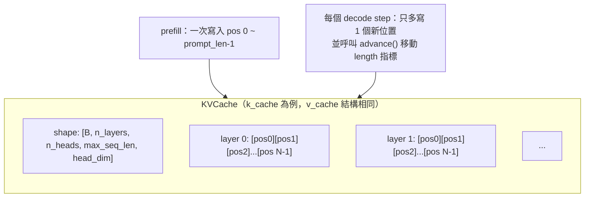
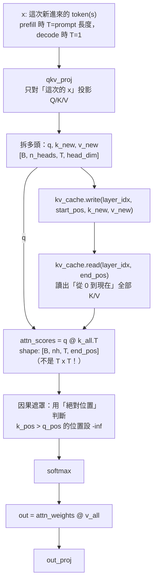
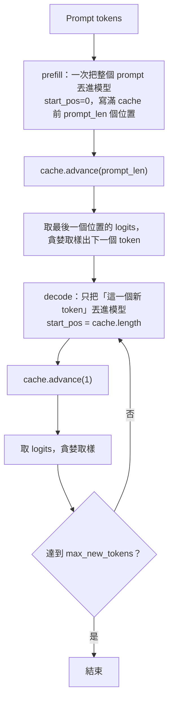

# Stage 1：手刻 KV Cache

## 這階段要解決的問題

Stage 0 的樸素生成迴圈，每個 decode step 都把「目前為止的整個序列」重新丟進模型算一次。
但如果仔細看 attention 內部：
**舊 token 的 K、V 向量，在每一步的數值都完全一樣**
（K、V 只跟 token 本身的內容、位置有關，不受「後來又生成了什麼」影響）。

既然算過就不會變，那就把它存起來，之後直接讀，不用重算——這就是 KV Cache 的全部想法。

## 架構：KVCache 資料結構



**關鍵設計決定 —— 為什麼 `n_heads` 排在 `max_seq_len` 前面**：

attention 層算完 Q/K/V 之後，會把 shape 拆成 `[B, n_heads, T, head_dim]`
（`n_heads` 在 `T` 前面，這是為了做 batched matmul）。
KVCache 的記憶體排列刻意跟這個順序對齊成`[B, n_layers, n_heads, max_seq_len, head_dim]`，
寫入/讀出時才不需要額外做 transpose——這是第一版寫的時候踩到的一個坑：
一開始把`max_seq_len` 排在 `n_heads` 前面，
結果 `cache[:, layer_idx, start:end] = k`在維度對不上時，
直接噴 `RuntimeError: The expanded size of the tensor (4) must match the existing size (10)`，
修正方式就是把兩個維度的順序對調，讓存取時的 slicing 對象跟 K/V 的實際 shape 一致。

## 架構：有 Cache 的 Attention



**跟 Stage 0 唯一的數學差異，只有兩處**：

1. Q/K/V 投影只對「這次新進來的 x」做，不是整個序列。
2. attention scores 的形狀是 `[B, nh, T, end_pos]`，不是 `[B, nh, T, T]`——
   query 只有這次新進來的 T 個，但 key 是「快取裡全部」的 `end_pos` 個。

因果遮罩用了一個通用公式，能同時處理 prefill 跟 decode：

```python
"""
用「絕對位置」建立 💥 關鍵因果遮罩(Causal Mask)。
q_pos: 這次 T 個 query 的絕對位置，例如 start_pos=5, T=3 -> [5, 6, 7]
k_pos: 目前快取裡全部 key 的絕對位置，例如 [0, 1, ..., end_pos-1]
mask[i, j] = True 代表「第 i 個 query 看不到第 j 個 key」，
也就是 j（key 的絕對位置）比 i（query 的絕對位置）還晚。

ex.
# prefill: start_pos=0, T=3, end_pos=3
# 跟 Stage 0 一模一樣，產生一個 3 x 3 的 causal mask，因為前面的字不能偷看後面的字。
q_pos = [0, 1, 2]
k_pos = [0, 1, 2]
causal_mask = [[False, True,  True ],
               [False, False, True ],
               [False, False, False]]

# decode 第 1 步: start_pos=3, T=1, end_pos=4
# 產生一個 1 x 4 的 causal mask，唯一的 query 可以看到所有已快取的 key。
q_pos = [3]
k_pos = [0, 1, 2, 3]
causal_mask = [[False, False, False, False]]

# decode 第 2 步: start_pos=4, T=1, end_pos=5
# 產生一個 1 x 5 的 causal mask，唯一的 query 可以看到所有已快取的 key。
q_pos = [4]
k_pos = [0, 1, 2, 3, 4]
causal_mask = [[False, False, False, False, False]]
"""
q_pos = [start_pos, start_pos+1, ..., start_pos+T-1] # 這次 query 的絕對位置
k_pos = [0, 1, ..., end_pos-1] # 快取裡全部 key 的絕對位置
mask[i, j] = k_pos[j] > q_pos[i] # key 比 query 晚出現 -> 看不到
```

- prefill 時 `start_pos=0`，這條公式會退化成跟 Stage 0 一模一樣的 `T x T` 下三角遮罩。
- decode 時 `T=1`，這個唯一的 query 一定能看到所有已快取的 key（它們全部都比它早），實際上完全不需要遮罩，但用同一條公式處理，程式碼不用為兩種情況各寫一份邏輯。

## 架構：Prefill + Decode 生成流程



對照 Stage 0 的樸素迴圈：
Stage 0 的每一圈都等同於「重做一次完整 prefill」；
Stage 1 只有第一圈是真正的 prefill，之後每一圈都只處理 1 個 token。

## 正確性驗證：跟 Stage 0 數學上完全等價

這是本階段最重要的部分。KV cache 只是「換一種方式計算同一個
數學函數」，不應該改變模型的任何輸出。驗證分兩層：

1. **只做一次性 prefill**（不做任何 decode）：
   此時 Stage 1 的計算路徑應該跟 Stage 0 的一次性 forward 完全相同
   （因為 `start_pos=0`時因果遮罩公式會退化成一樣的下三角矩陣），
   所以 logits 必須`torch.allclose` 逐數值相等。
2. **完整跑 prefill + 逐 token decode**：
   在貪婪取樣下，生成出來的文字必須跟 Stage 0 的 `naive_generate` **逐字元相同**。

兩個測試都通過（見 `tests/test_stage1_kv_cache.py`），
代表 Stage 1 的優化是「純粹的加速」，沒有偷偷改變模型的行為——
這是往後每一階段（PagedAttention、continuous batching...）都要遵守的紀律：
先證明「跟上一版行為一致」，再談「快了多少」。

## 這階段做了什麼

- `mini_vllm/layers/kv_cache.py`：
  `KVCache` 類別，管理一整個 batch、所有層的 K/V 快取，提供 `write` / `read` / `advance` / `reset`。
- `mini_vllm/layers/attention.py`：
  `CausalSelfAttentionWithCache`，跟 cache 互動、用絕對位置算因果遮罩。
- `mini_vllm/models/tiny_transformer_kv.py`：`TinyTransformerKV`，跟 Stage 0 的 `TinyTransformer` 架構相同（甚至直接重用了 `MLP`），只是 attention 換成有 cache 的版本，forward 多了 `kv_cache` / `start_pos` 兩個參數。
- `examples/kv_cache_generate.py`：
  prefill + decode 的生成範例，附上逐 step 計時。
- `tests/test_stage1_kv_cache.py`：
  - KVCache 本身的寫入/讀出/溢位測試
  - **正確性核心測試**：跟 Stage 0 數值完全一致、生成文字完全一致

## 如何執行

```bash
python examples/kv_cache_generate.py
pytest tests/ -v
```

## 觀察到的結果（本機 CPU，2014 MacBook Pro i7）

用跟 Stage 0 相同的迷你模型設定（`hidden_dim=128, n_layers=2`）、生成 40 個 token：

| 版本 | decode 平均每 step 耗時 |
|---|---|
| Stage 0（樸素，每步重算全部）| ~3.2 - 3.6 ms |
| Stage 1（KV cache，每步只算新 token）| ~1.0 ms |

即使在這個小模型、CPU、序列長度只有 40-50 的規模下，**已經看得出約 3 倍的 decode 加速**。
這還只是序列很短的情況；序列越長、模型越大，Stage 0 O(n²) 跟 Stage 1 O(n) 的差距只會越拉越開。

## 已知限制（留給 Stage 2 解決）

- **記憶體浪費**：
  每個序列一開口，就要預先配置一整塊 `[max_seq_len, ...]` 大小的 K/V cache，
  不管實際會用到多少。100 個並發序列、每個都預留 max_seq_len，記憶體很快就爆了。
- **無法跨序列共享**：
  如果 100 個請求有同樣的 system prompt，
  Stage 1 的做法是每個序列各自重複存一份一模一樣的 K/V，沒有辦法共享。
- **固定上限**：
  `max_seq_len` 是寫死的，序列一旦超過就直接報錯
  （`KVCache.write` 裡那個 `ValueError`），沒有動態擴充的機制。

這三個問題，正是 vLLM 論文裡 PagedAttention 要解決的核心問題——借用作業系統「分頁記憶體」的概念，把 KV cache 切成固定大小的 block，用「不連續但可定址」的方式管理，這就是 Stage 2 的內容。

## 檢查點（自我驗收）

- [ ] 能解釋為什麼只有 K、V 需要被快取，Q 不需要
- [ ] 能解釋為什麼 MLP 不需要任何形式的快取
- [ ] 能不看程式碼，寫出因果遮罩的通用公式（用絕對位置表示）
- [ ] 能解釋為什麼「prefill 一次性 forward」的 logits 必須跟 Stage 0 完全相等，這個等價性驗證的意義是什麼
- [ ] 能講出 Stage 1 目前這個 KVCache 設計的至少三個限制

## 下一步：Stage 2

把 Stage 1 這種「每個序列預先配置一整塊連續記憶體」的 KVCache，改造成 PagedAttention：
切成固定大小的 block，用 block table 管理不連續的記憶體，並支援動態配置、釋放、（Stage 4 之後）跨序列共享 block。
