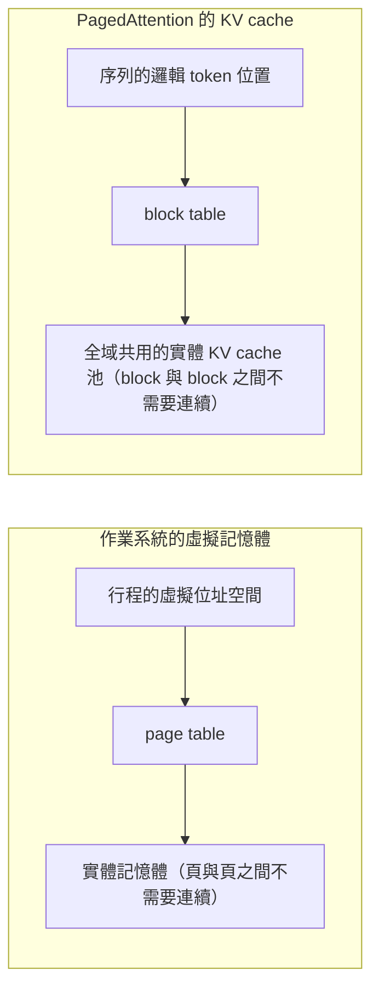
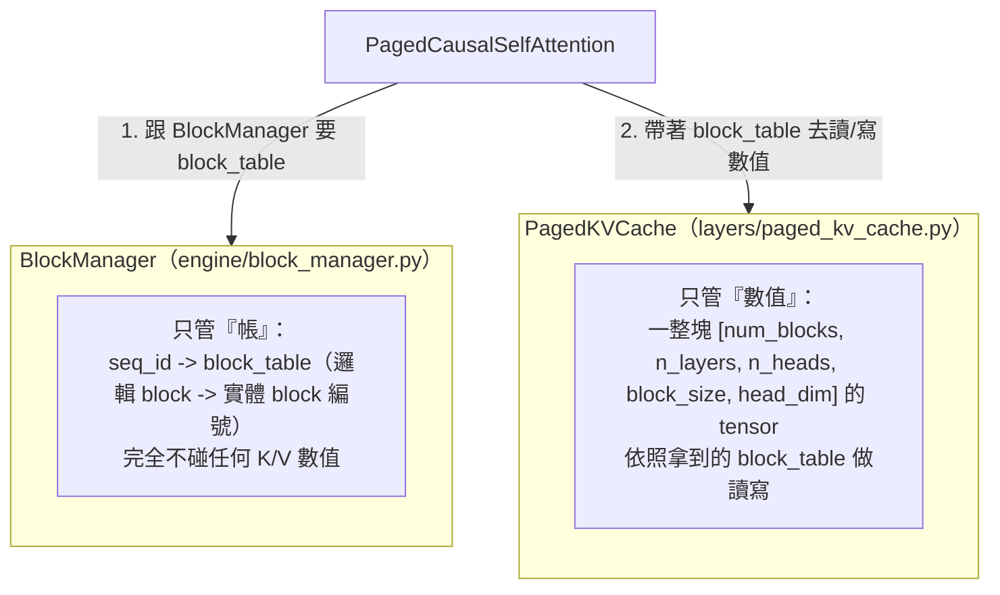
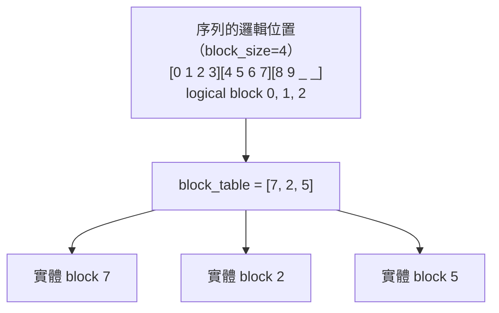

# Stage 2：PagedAttention — Block-based KV Cache

> 這是整個計畫最重要的一關。前面的 Stage 都是「怎麼算得對、算得快」，
> 這一關是「怎麼管理記憶體」——而管理記憶體的方式，才是 vLLM
> 之所以能大幅提升吞吐量的真正原因。

## 這階段要解決的問題

Stage 1 的 `KVCache` 有一個根本缺陷：
**每個序列一開口，就要預先配置一整塊 `[max_seq_len, ...]` 大小的連續記憶體**，不管這個序列實際上會用到多少。

具體有多浪費？在本階段的示範腳本裡量到的數字：
三個實際長度只有 18-20 個 token 的序列，`max_seq_len=256`：

- Stage 1 做法：相當於用掉 192 個 block 大小的資源
- Stage 2 做法：實際只用了 15 個 block
- **節省 92.2%**

這還只是三個短序列的極端例子；但方向是對的——
**浪費程度跟「序列實際長度 vs max_seq_len 的差距」成正比**，
而真實世界的請求長度分布很廣（有人問一句話，有人貼一整篇文章），這個浪費是真的。

## 核心想法：借用作業系統的分頁記憶體



| OS 分頁記憶體 | PagedAttention |
|---|---|
| page（固定大小的頁）| block（固定大小、存 N 個 token 的 K/V）|
| page table | block table |
| 實體記憶體，頁不用連續 | 全域 KV cache 池，block 不用連續 |
| 行程要記憶體時跟 OS 要一頁 | 序列要空間時跟 BlockManager 要一個 block |

**關鍵想法**：
不要求一個序列的 K/V 存在連續記憶體裡。整個 KV cache 被切成很多固定大小的 block，
序列需要多少就跟全域 free pool 要幾個，用完了就還回去。

## 架構：兩層責任分離

Stage 2 刻意把「記帳」跟「存數值」分成兩個獨立的元件：



這個分離不是為了炫技，是有實際好處的：
**BlockManager 完全不知道tensor 長什麼樣子**，
之後如果要換一種底層儲存方式（例如量化成FP8、換成別的記憶體佈局），
只需要動 `PagedKVCache`，`BlockManager`的配置/釋放邏輯完全不用改。

## 架構：一個序列的 block table 長什麼樣



`block_table = [7, 2, 5]` 的意思：
這個序列的邏輯 block 0 存在全域池子的第 7 號、邏輯 block 1 存在第 2 號、邏輯 block 2 存在第 5 號。
這三個實體 block 完全不需要相鄰——這就是「Paged」的精神。

## 核心數學：位置怎麼換算成 (block, offset)

寫入/讀出時，都要把「序列內的絕對位置」換算成「block table 裡的第幾個、block 內的第幾格」：

```
block table 裡的索引 = 絕對位置 // block_size
block 內的偏移量     = 絕對位置 %  block_size
```

讀取時反過來：
先用 PyTorch 的進階索引（advanced indexing）一次把 `block_table` 指到的所有實體 block gather 出來，
再把「block 維度」跟「block 內位置維度」攤平合併成一個連續的「序列位置」維度：

```python
gathered_k = self.k_pool[used_block_ids, layer_idx]  # [num_blocks, n_heads, block_size, head_dim]
gathered_k = gathered_k.permute(1, 0, 2, 3).reshape(n_heads, -1, head_dim)
```

這一步完全用純 PyTorch indexing 做到，不需要寫任何 CUDA/Triton kernel——
這也是為什麼這一關可以在 CPU-only 的環境完整做完：
PagedAttention 的核心價值是「記憶體管理演算法」，
硬體加速（CUDA kernel 版的 gather）是另一個層次的優化，屬於 Stage 6。

## BlockManager 的關鍵方法：`ensure_capacity`

這是整支 `BlockManager` 裡最重要的一個方法，設計成**冪等、只增不減**：

```python
def ensure_capacity(self, seq_id, num_tokens):
    needed = self.num_blocks_needed(num_tokens)
    table = self.block_tables.setdefault(seq_id, [])
    while len(table) < needed:
        table.append(self.free_block_ids.popleft())  # 不夠才去要新的
    return table
```

同一個方法可以同時處理兩種情境：

- **prefill**：
  `ensure_capacity(seq_id, prompt_len)`，一次配置好整個 prompt 需要的 block。
- **decode**：
  每生成 1 個新 token 就呼叫 `ensure_capacity(seq_id, cache.length + 1)`，
  通常什麼都不會發生（上一個 block 還有空位），
  只有真的跨過 block 邊界時，才會去 free pool 要 1 個新 block——
  示範腳本裡印出來的「跨過 block 邊界，新配置 1 個 block」訊息，就是這件事實際發生。

## 正確性驗證：跟 Stage 0 / Stage 1 完全等價

跟前面每個階段一樣的紀律：**優化不能改變行為**。

`tests/test_stage2_paged_attention.py` 裡最重要的測試，
是把跟 Stage 0/1 完全相同的權重載入 `TinyTransformerPaged`，跑完整的 prefill + decode，
貪婪取樣下的輸出必須跟 Stage 0（樸素）、Stage 1（連續記憶體 KV cache）**三方逐字元相同**：

```python
assert text_v0 == text_v1 == text_v2
```

三個版本的計算路徑完全不同（有沒有 cache、cache 連不連續），但只要數學等價，輸出就該一致——這個測試通過，
代表 PagedAttention的改動「只換了記憶體怎麼擺」，沒有動到 attention 本身算出來的任何一個數字。

另外還驗證了一個 Paged 設計特有的情境：
**block table 刻意不連續**（先分配、釋放、讓另一個序列插隊拿走中間的 block，
逼出一個像`[0, 2]` 這種不連續的 block table），確認讀出來的內容順序依然正確地按照「邏輯位置」排列，
而不是被「實體編號」打亂。

## 這階段做了什麼

- `mini_vllm/engine/block_manager.py`：
  `BlockManager`，只管配置/釋放/記帳，`ensure_capacity` / `free` / `memory_usage_summary`。
- `mini_vllm/layers/paged_kv_cache.py`：
  `PagedKVCache`，全域共用的實體 K/V tensor 池，依 block table 讀寫。
- `mini_vllm/layers/paged_attention.py`：
  `PagedCausalSelfAttention`，跟 Stage 1 的 attention 數學完全相同，
  只是讀寫快取的方式換成透過 block table 轉址。
- `mini_vllm/models/tiny_transformer_paged.py`：
  `TinyTransformerPaged`，架構跟前兩階段相同，重用 `MLP`。
- `examples/paged_attention_generate.py`：
  三個序列先後共用同一個 block 池的完整生命週期示範，附記憶體效率比較。
- `tests/test_stage2_paged_attention.py`：
  11 個測試，涵蓋 BlockManager 的配置/釋放/邊界情況、
  PagedKVCache 讀寫正確性（含刻意不連續的 block table）、
  以及跟 Stage 0/1 的三方等價驗證。

## 如何執行

```bash
python examples/paged_attention_generate.py
pytest tests/ -v
```

## 觀察到的結果（本機 CPU，2014 MacBook Pro i7）

用 `block_size=4, num_blocks=24` 的池子，跑三個 prompt 長度 10-13 字元、各生成 6-10 個 token 的序列：

- 每個序列 prefill 後正確拿到 `ceil(prompt_len/4)` 個 block（例如 10 字元的 prompt 拿到 3 個 block）。
- decode 過程中，只有序列長度真的跨過 4 的倍數邊界時，才會看到「新配置 1 個 block」的訊息，
  其餘 step 完全不觸碰 BlockManager 的 free pool——
  證實了 `ensure_capacity` 的「只在需要時才配置」行為符合預期。
- 每個序列結束後呼叫 `free()`，池子完全恢復到初始的 24 個 free block，
  下一個序列可以重新利用（包含拿到跟前一個序列一模一樣的實體 block 編號）。
- 記憶體效率比較：這批短序列在 Stage 1 做法下相當於用掉 192 個 block 大小的資源，
  Stage 2 只用了 15 個，節省 92.2%。

## 已知限制（留給後續 Stage 解決）

- **仍然是「一次一個序列」在跑**：
  `paged_generate` 每次呼叫只處理一個序列的完整 prefill+decode，
  多個序列是「先後」共用同一個池子，不是「同時」批次運算。
  真正的同時處理、動態排程（新序列什麢時候加入、記憶體不夠時搶佔誰）——
  是 Stage 3 Continuous Batching + Scheduler 的工作。
- **沒有跨序列共享 block**：
  即使兩個序列有一模一樣的開頭（例如相同的 system prompt），
  Stage 2 目前的做法還是各自佔用一份獨立的 block，沒有辦法共享——
  這是 Stage 4 Prefix Caching 要解決的問題。
- **記憶體不夠時直接報錯**：
  `ensure_capacity` 池子滿了會丟 `MemoryError`，
  沒有「搶佔（preempt）某個序列來騰出空間」的機制——這也是 Stage 3 排程器要處理的情境。

## 檢查點（自我驗收）

- [ ] 能解釋 PagedAttention 跟 OS paging 的類比：page ↔ block、page table ↔ block table 分別對應什麼
- [ ] 能不看程式碼，寫出「絕對位置 -> (block 索引, block 內偏移)」的換算公式
- [ ] 能解釋為什麼 `BlockManager` 跟 `PagedKVCache` 要分成兩個獨立的類別，而不是合併成一個
- [ ] 能解釋 `ensure_capacity` 為什麼設計成「冪等、只增不減」，這個設計怎麼同時處理 prefill 跟 decode 兩種情境
- [ ] 能講出 Stage 2 目前這個設計還有哪些限制，分別對應到後面哪個 Stage 要解決

## 下一步：Stage 3

把「多個序列先後共用同一個池子」升級成「多個序列真正同時批次運算」：
實作 Scheduler 管理 `WAITING -> RUNNING -> FINISHED` 狀態機，
讓每個 decode step 都能動態讓新序列加入、讓完成的序列離開（continuous batching），
並在記憶體不夠時決定搶佔哪個序列。
