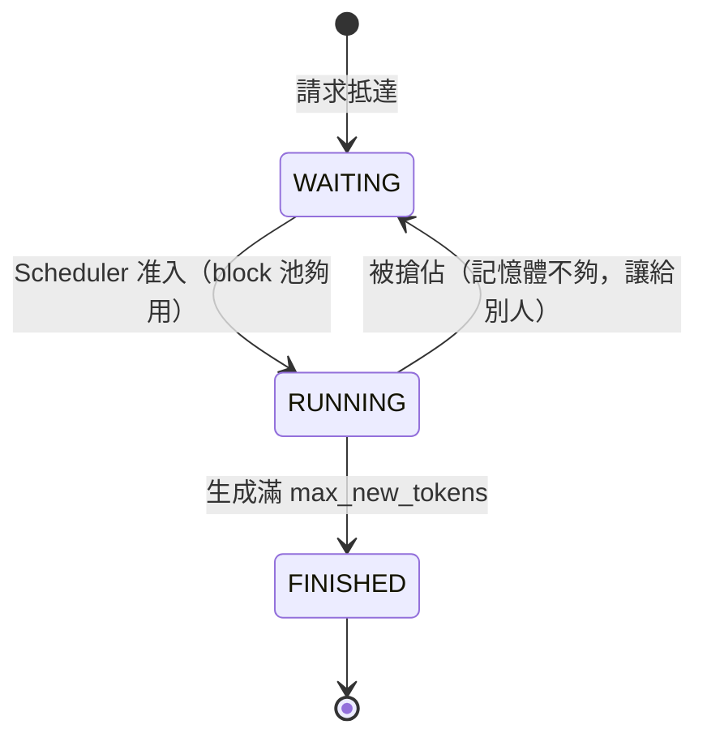
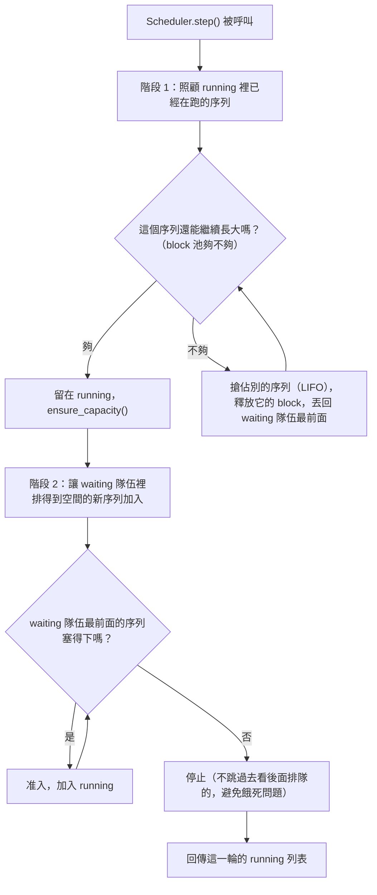

# Stage 3：Continuous Batching + Scheduler

## 這階段要解決的問題

Stage 2 已經能讓多個序列共用同一個 block 池，但方式是「先後」：
一個序列從 prefill 跑到生成完畢，才輪到下一個序列開始。這樣做的
問題跟傳統 batching 一樣——序列的生成長度不一，先做完的序列會
讓其他還在排隊、還沒排到的請求白白等待；反過來說，一個晚到的
請求，也得等前面的序列全部做完才能開始，不能中途插進來。

**Continuous batching 的精神**：每一個 engine step，都重新決定一次
「這一輪要跑哪些序列」。完成的序列立刻讓出位置，新抵達的請求只要
記憶體夠就能馬上加入，不需要等待其他序列先跑完。這支
`Scheduler` 就是做這個決定的地方。

## 架構：Sequence 狀態機



被搶佔是 `RUNNING -> WAITING`，不是 `-> FINISHED`：這個序列還沒
做完，只是要先讓出記憶體，之後排得到空間會重新排進 running。

## 核心設計：`next_forward_input()` 用同一條公式處理三種情境

這是 Stage 3 裡最關鍵的一個小設計，值得特別說明。`Sequence` 追蹤
兩個數字：

- `all_token_ids`：prompt + 目前已生成的內容，代表「這個序列到目前
  為止的完整內容」。
- `num_computed_tokens`：這個序列的 K/V cache 裡，已經反映了多少個
  token 的內容。

兩者的差，就是「還沒被算進 cache 的那一段」：

```
start_pos = num_computed_tokens
input_ids = all_token_ids[num_computed_tokens:]
```

這一條公式，同時涵蓋了三種原本感覺應該要分開處理的情境：

| 情境 | num_computed_tokens | all_token_ids | 這段公式算出來的 input_ids |
|---|---|---|---|
| 序列剛排進 running（初次 prefill）| 0 | 整個 prompt | 整個 prompt |
| 正常 decode | = all_token_ids 長度 - 1 | 多了 1 個新生成的 token | 只有那 1 個新 token |
| 被搶佔後重新排進 running（recompute）| 0（搶佔時被歸零）| prompt + 之前已生成的內容 | prompt + 已生成內容全部 |

不用為這三種情境各寫一份邏輯，`Scheduler` 跟生成迴圈完全不需要
知道「現在是哪一種情境」，呼叫 `next_forward_input()` 就好。

## 架構：Scheduler 的兩階段排程



**為什麼「已經在跑的序列優先」**：如果反過來讓新請求優先，一個
已經生成到一半的序列可能會被迫中斷讓新來的請求插隊，體感上非常
不公平（想像你的 ChatGPT 對話生成到一半突然卡住，因為別人的新
請求插隊）。

**為什麼新序列用 FCFS、不「跳過大請求去插隊小請求」**：如果允許
插隊，一個需要很多空間的大請求，可能在很小的請求源源不絕抵達時
永遠排不到——這是排程理論裡典型的「饑餓（starvation）」問題。

## 搶佔策略：Recompute

記憶體不夠時要犧牲誰？vLLM 論文提出兩種做法：

- **Recompute**：直接丟掉被搶佔序列的 KV cache，之後重新排進
  running 時，從頭把 prompt+已生成內容整段重新算一次。
- **Swap**：把 KV cache 換出到 CPU/硬碟，之後再換回來，不需要
  重算，但需要額外的記憶體搬移跟儲存管理。

Stage 3 採用 **recompute**，原因很直接：邏輯簡單、不需要額外的
儲存管理機制，而且跟 Stage 2 已經有的 `ensure_capacity()` 天然
契合——被搶佔的序列 `num_computed_tokens` 歸零之後，
`next_forward_input()` 自動就會算出「要重新處理整段內容」，完全
不需要另外寫一套 recompute 專用的邏輯。

犧牲者的挑選策略是 **LIFO**（踢掉最晚加入 running 的序列）：所有
能想到的策略裡最簡單、最容易預測、也最容易寫測試驗證的一種。
真實的 vLLM 會用更精細的策略（例如優先權、公平性），但這個選擇
是可以獨立替換的一個模組，不影響 Scheduler 其他部分的設計。

## 寫程式碼時真的踩到的兩個 bug

這兩個 bug 都跟「一邊迭代 list、一邊修改同一個 list」有關，值得
記錄下來，因為這是寫排程邏輯時很容易犯、也很典型的錯誤模式。

**Bug 1**：一開始 `_preempt_last_running` 直接對 `self.running`
做 `pop(i)`，而外層又用 `for seq in self.running:` 迭代同一個
list。Python 的 `for` 迴圈是用 index 往前走的，迭代中途 pop 掉
別的元素，會讓 index 對不齊，導致某些序列被跳過——這些被跳過的
序列如果剛好是「應該被踢出去、但因為跳過而沒被處理到」的，就會
出現「序列明明在回傳的 running 列表裡，但它的 block 已經被釋放、
block_table 是空的」這種矛盾狀態，一 forward 就直接 `IndexError`。

**Bug 2（更隱蔽，修了 Bug 1 之後才浮現）**：即使改成先 `list(...)`
取快照再迭代，還是有一個更微妙的順序問題——序列 A 在自己的迴圈
回合被判定「可以繼續跑」，加進了 `still_running`；但後面處理序列
B 時，B 反過來把 A 搶佔了。這種「先允許、後反悔」的情況，`for`
迴圈本身抓不到，因為 A 已經在更早的回合被寫進 `still_running`，
之後 B 那一回合的搶佔不會回頭修正它。

修正方式：全程只用 `preempted_ids` 這個集合做「誠實的帳」，最後
才用它對 `still_running` 做一次過濾：
`self.running = [s for s in still_running if s.seq_id not in preempted_ids]`。
這樣不管一個序列是在自己回合被踢、還是在別人回合事後被踢，
最終結果都正確。

## 已知的簡化範圍

`examples/continuous_batching_generate.py` 裡的模型 forward 呼叫，
仍然是「每個序列各自呼叫一次」（`for seq in running: model(...)`），
還沒有真正把多個序列的 tensor 疊在一起、用一次 forward 呼叫算完
整批。

這是刻意的取捨：不同序列的長度不同、block table 不同，要把它們
疊成一個 batch tensor 一次算完，需要處理 padding、mask 等技巧
（這正是 vLLM 真正的 CUDA kernel 用「varlen attention」解決的
問題）。**本階段展示的是「排程政策」這個層次的 continuous
batching**——動態准入、動態搶佔、序列交錯執行——這正是
continuous batching 這個詞最早被提出時指的東西；把多個序列的
forward 融合成一次 kernel 呼叫，是更底層的效能優化，留給
Stage 6（也呼應 Stage 2 文件裡「多序列批次留給 Stage 3」的說法：
這裡完成的是排程層次的批次，kernel 層次的批次融合是進一步的
優化項目）。

## 這階段做了什麼

- `mini_vllm/engine/sequence.py`：`Sequence` 狀態機，
  `next_forward_input()` 統一處理 prefill/decode/recompute。
- `mini_vllm/engine/scheduler.py`：`Scheduler`，兩階段排程
  （先顧 running、再准入 waiting），LIFO 搶佔 + FCFS 准入。
- `examples/continuous_batching_generate.py`：模擬三個請求交錯
  抵達、交錯完成、中途發生搶佔的完整流程。
- `tests/test_stage3_continuous_batching.py`：10 個測試，涵蓋
  Sequence 狀態機、Scheduler 准入/FCFS/搶佔，以及**正確性核心**：
  交錯排程 + 搶佔後的生成結果，必須跟每個序列「獨立跑、不受任何
  人干擾」的結果完全相同。

## 如何執行

```bash
python examples/continuous_batching_generate.py
pytest tests/ -v
```

## 觀察到的結果（本機 CPU，2014 MacBook Pro i7）

用 `block_size=4, num_blocks=8` 的小池子，三個序列（seq-A、
seq-B 於 step 0 抵達，seq-C 延後於 step 2 抵達）：

```
[step  0] admit: seq-A 加入 running
[step  0] admit: seq-B 加入 running
[step  2] seq-C 抵達，加入 waiting queue
[step  4] preempt: seq-A 讓給 seq-B
[step  7] seq-B 完成
[step  8] admit: seq-A 加入 running
[step  8] admit: seq-C 加入 running
[step 10] preempt: seq-A 讓給 seq-C
[step 17] seq-C 完成
[step 18] admit: seq-A 加入 running
[step 21] seq-A 完成
```

seq-A 在整個過程中被搶佔了兩次，最後才完成——但它最終生成的文字
`'the quick ip nnntnav'`，跟「seq-A 自己獨立、用寬裕記憶體池」跑
出來的結果**逐字元相同**（測試 `test_continuous_batching_matches_
isolated_generation_even_with_preemption` 驗證的就是這件事）。
這證明 recompute 式搶佔，不管中途被打斷幾次、順序被打亂成什麼樣，
數學上都是無損的。

## 檢查點（自我驗收）

- [ ] 能不看程式碼，畫出 Sequence 的狀態轉移圖
- [ ] 能解釋 `next_forward_input()` 這條公式，為什麼能同時處理
      prefill、decode、recompute 三種情境
- [ ] 能解釋為什麼「已經在跑的序列優先」、「新序列用 FCFS 不插隊」
      這兩個設計決定分別在避免什麼問題
- [ ] 能解釋 recompute 跟 swap 這兩種搶佔策略的差異、各自的
      取捨是什麼
- [ ] 能講出「迭代 list 時修改同一個 list」這個 bug 模式，
      以及為什麼在 Scheduler 的搶佔邏輯裡特別容易踩到
- [ ] 能講出這一階段的 continuous batching 目前只做到「排程層次」、
      還沒做到「kernel 層次」，兩者的差異是什麼

## 下一步：Stage 4

讓多個序列除了共用同一個 block 池之外，還能**共享**內容一模一樣的
block——如果 100 個請求有同樣的 system prompt，目前每個序列還是
各自佔用一份獨立的 block，完全沒有共享。Stage 4 Prefix Caching
會對每個 block 的內容算 hash，內容相同的 block 直接共用（reference
count + 1），並處理好 copy-on-write。
