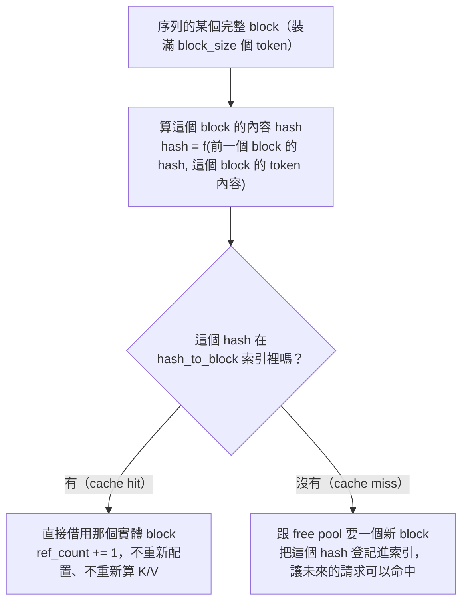
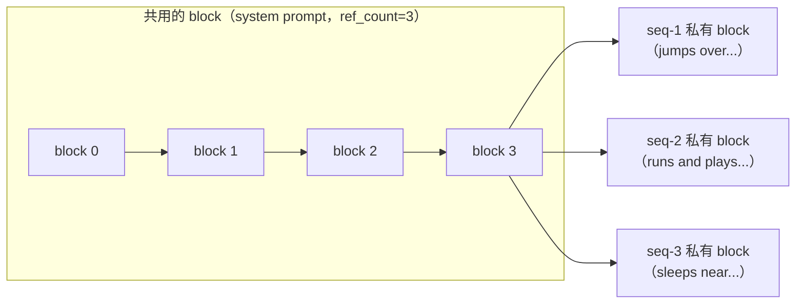
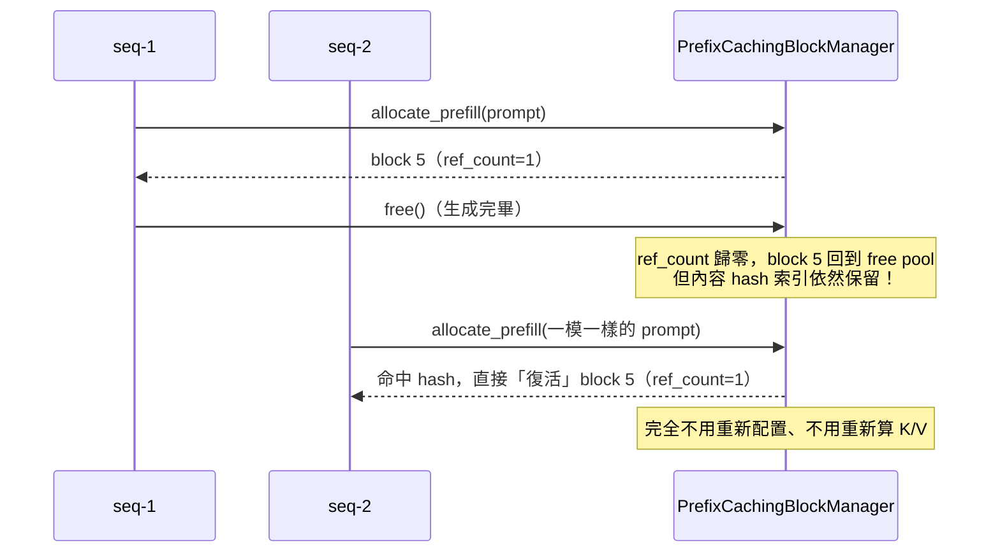

# Stage 4：Prefix Caching

## 這階段要解決的問題

Stage 2 的 PagedAttention 已經能讓多個序列共用同一個 block 池，
但每個序列的 block 內容還是各自獨立——即使兩個請求有一模一樣的
開頭（最常見的情境：同一個 system prompt，接不同的使用者輸入），
它們還是會**各自佔用一份獨立的 block、各自重新計算一遍一模一樣的
K/V**。

Prefix caching 的想法很直接：如果兩個序列的某一段開頭 token 完全
相同，那這段內容算出來的 K/V 也會完全相同（模型是確定性函數）。
既然如此，直接讓它們**共用同一份 block**，第二個以後的請求根本
不需要重新算——這既省記憶體，更省下真正的矩陣運算時間。

## 架構：內容定址 + 鏈式 Hash



**為什麼 hash 要「鏈式」，不能只 hash 這個 block 自己的內容**：
如果只看單一 block 自己裝的 token，兩個序列即使某個 block 內容
剛好相同，但更前面的 block 不同，也會被誤判成可以共用。鏈式
hash（`hash = f(前一個 block 的 hash, 這個 block 的內容)`）保證了
「共用某個 block」等於「共用它以及它之前所有 block 代表的完整
前綴」——這正是 **prefix**（前綴）caching 這個名字的意義所在，
不是「內容剛好一樣的任意片段」都能共用，只有「從頭開始就一樣的
前綴」才算數。

## 架構：三個序列共用同一段 system prompt



三個請求的 system prompt 完全相同，對應到的前幾個 block 被
**同時共用**（`ref_count=3`），從 system prompt 結束的地方開始，
各自的內容才分岔成私有 block。

## 為什麼這個設計不需要 Copy-on-Write

Prefix caching 教學文章常強調 copy-on-write（COW）：被共用的 block
如果之後需要修改，得先複製一份，不能直接改，否則會弄髒其他序列
的資料。

Stage 4 用一個設計上的簡化，讓 COW 變得**不需要**：**每個序列的
prompt，它的最後一個邏輯 block，永遠是這個序列私有、新配置的
block，不會拿去跟快取比對，也不會被登記成可共用的項目**——即使
它的內容剛好跟別人一模一樣。

**理由**：block 快取的是「K/V 數值」，不是「logits」。要生成 prompt
之後的第一個新 token，一定得針對 prompt 最後一個位置**真的跑一次
forward** 拿到 logits，而 forward 的過程一定會把這個位置的 K/V
「寫」進它所在的 block。如果這個 block 是被別人共用的，這一寫就
會弄髒別人的 K/V——這正是 COW 要解決的問題。保留「最後一個 block
永遠私有」這條規則，從根本避免了這個情境，被共用的 block 因此
天生就是唯讀的，完全不需要額外的複製機制。這不是逃避問題，是
一個跟真正的 vLLM 一致的工程取捨：快取比對的長度一定嚴格小於
prompt 全長，保留至少 1 個 token 需要真的算，理由完全一樣。

## 設計取捨：只在 Prefill 階段比對/註冊快取

`PrefixCachingBlockManager` 提供兩個方法：

- `allocate_prefill(seq_id, prompt_token_ids)`：序列第一次配置
  block 時呼叫，會嘗試命中/註冊快取。
- `grow_private(seq_id, num_tokens)`：decode 過程中呼叫，單純
  按需配置新 block，**不做任何快取比對**。

這是刻意的簡化：prefix caching 真正有價值的地方，是「不同請求
共用的開頭」（system prompt、few-shot 範例），而 decode 逐 token
生成出來的內容，幾乎不可能被其他請求原封不動命中（貪婪取樣下，
兩個完全不同的請求會走上完全不同的生成路徑）。把「比對快取」限定
在 prefill 階段，讓程式碼保持簡單，幾乎不損失實際效益。

## 參照計數與「復活」被釋放的 block



一個 block 被釋放（`ref_count` 歸零）之後，只是回到 free pool，
它的內容 hash 索引**不會被清掉**。只要這個 block 還沒被別的新
內容覆寫，之後有序列剛好需要一模一樣的前綴，還是可以立刻命中、
「復活」它——這正是 vLLM 論文裡「被驅逐的 block 只要還沒被覆寫，
內容依然可以被重新命中」的行為，也是這個測試在驗證的東西：
`test_freed_block_content_hash_persists_until_overwritten`。

反過來，如果一個被釋放的 block 被拿去存**全新**的內容（cache
miss 配置），它舊的 hash 索引必須立刻失效——不然之後會有人拿舊
hash 查到這個 block，卻讀到跟 hash 完全對不上的內容。這是
`_take_from_free_pool()` 裡的關鍵一步：拿出一個 block 之前，
先把它可能殘留的舊 hash 記錄清掉。

## 這階段做了什麼

- `mini_vllm/engine/prefix_cache_block_manager.py`：
  `PrefixCachingBlockManager`（繼承 Stage 2 的 `BlockManager`），
  新增鏈式 hash、參照計數、`allocate_prefill()` / `grow_private()`
  / `free()`（改為 ref-count 感知）。
- `examples/prefix_caching_generate.py`：三個請求共用同一段
  system prompt 的完整示範，附命中統計與效能比較。
- `tests/test_stage4_prefix_caching.py`：8 個測試，涵蓋內容比對
  正確性（相同/分岔的 prompt）、最後一個 block 永遠不共用、
  free 後的 hash 保留與覆寫失效，以及**正確性核心**：命中快取
  跳過部分計算，生成結果仍與 Stage 2 baseline 完全一致。

## 如何執行

```bash
pip install -r requirements.txt   # 需要 xxhash
python examples/prefix_caching_generate.py
pytest tests/ -v
```

## 觀察到的結果（本機 CPU，2014 MacBook Pro i7）

三個請求共用 `"the quick brown fox "`（21 字元）這段開頭，
`block_size=4`：

| 請求 | prompt 長度 | 命中快取 token 數 |
|---|---|---|
| seq-1（第一個，冷啟動）| 31 | 0 |
| seq-2 | 35 | 20 |
| seq-3 | 42 | 20 |

三個請求結束後，`prefix_cache_stats()` 顯示 block 0-4 共 5 個
block 被 3 個序列同時共用（`ref_count=3`）。

**效能比較**（forward 實際算過的 token 數，這是比 Stage 2 的
記憶體節省更進一步的指標，因為省下的是真正的矩陣運算）：

- 沒有 prefix caching：135 個 token
- 有 prefix caching：95 個 token
- **省下 40 個 token 的計算量（29.6%）**

這只是 3 個短序列的示範；真實世界裡，如果一個服務有大量請求共用
同一組很長的 system prompt（例如幾百個 token 的角色設定），
prefix caching 省下的計算量會遠比這個數字更可觀。

## 已知限制

- **只在 prefill 階段生效**：decode 生成出來的內容不會被拿去比對
  或註冊快取（見前面的設計取捨說明）。
- **只能共用「從頭開始」的前綴**：如果兩個請求中間某段內容剛好
  相同、但開頭不同，不會被辨識出來——這是鏈式 hash 的必然結果，
  也符合「prefix」caching 名稱的定義範圍。
- **LIFO/簡單的 free pool 選擇順序**：`free_block_ids` 改成 `set`
  之後，`_take_from_free_pool()` 用 `pop()` 拿出來的順序是不可預期
  的（不像 Stage 2 的 deque 是固定的 FIFO）。這不影響正確性
  （拿到哪個實體編號都一樣能用），只是少了 Stage 2 那種「輸出結果
  可以預期特定 block 編號」的性質，測試也相應地避免依賴具體編號
  （除了透過 hash 命中邏輯明確驗證的案例）。
- **還沒跟 Stage 3 的 Scheduler 整合**：本階段的示範腳本沒有經過
  Scheduler（跟 Stage 2 的示範腳本一樣，是序列先後跑），要把
  prefix caching 跟 continuous batching 的動態排程整合在一起，
  需要 Scheduler 在准入序列時呼叫 `allocate_prefill` 而不是原本
  的 `ensure_capacity`——這是一個可以獨立完成的整合工作，這裡
  先把 prefix caching 本身的機制單獨講清楚。

## 檢查點（自我驗收）

- [ ] 能解釋為什麼 block 的 hash 要設計成「鏈式」，只 hash 自己
      的內容為什麼不夠
- [ ] 能解釋這個設計為什麼不需要 copy-on-write，關鍵的那條規則
      是什麼
- [ ] 能解釋為什麼「最後一個 block 永遠私有」這條規則，本質上是
      在保護什麼東西不被弄髒
- [ ] 能解釋一個被釋放的 block，為什麼它的內容 hash 索引不會立刻
      被清掉，什麼時候才會真的失效
- [ ] 能講出為什麼這個實作選擇只在 prefill 階段做快取比對，
      這個取捨犧牲了什麼、換到了什麼

## 下一步：Stage 5

處理另一個跟延遲相關的排程問題：一個很長的 prefill（例如幾千個
token 的 prompt）如果整批塞進一個 engine step，會讓同一批次裡其他
序列的 decode 被卡住很久，拉高 tail latency。Stage 5 Chunked
Prefill 會把長 prefill 切成固定大小的 chunk，跟 decode token
混合排程，讓每個 step 都能兼顧「讓 decode 序列持續拿到新 token」
跟「讓長 prefill 慢慢推進」。
