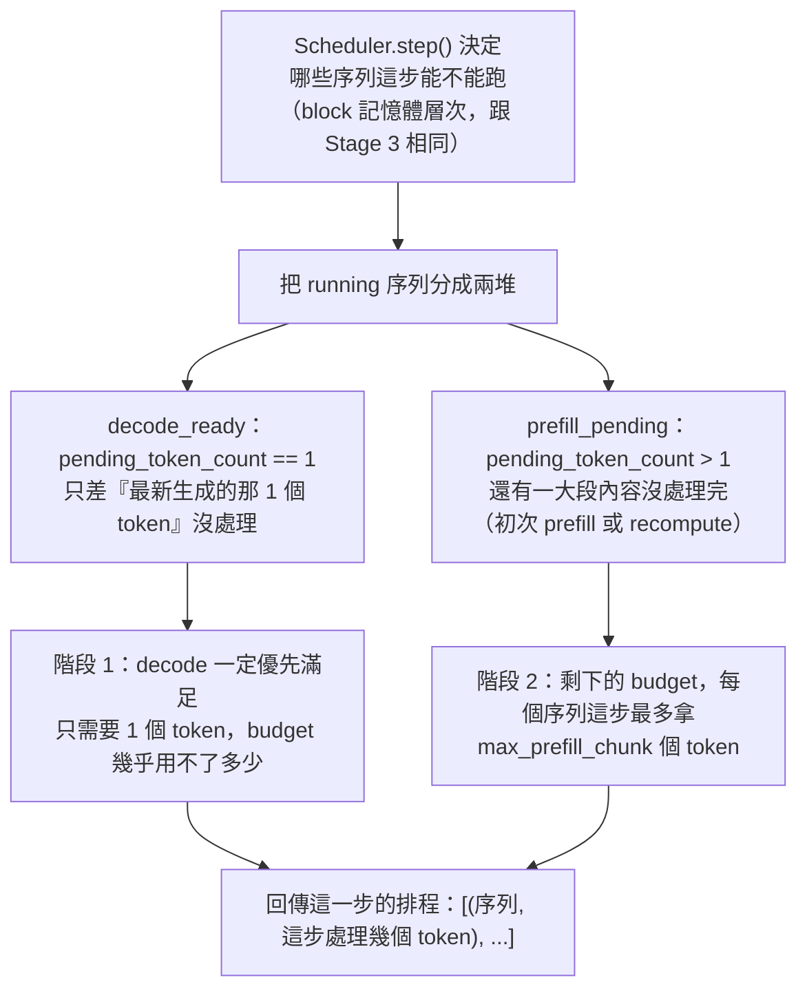

# Stage 5：Chunked Prefill

## 這階段要解決的問題

Stage 3 的 Scheduler 有一個沒被明講的假設：一個序列只要被排進
running，這一步就會把它「所有還沒算過的內容」一次處理完（見
`Sequence.next_forward_input()` 原本沒有長度上限）。序列都很短的
時候沒問題，但如果有一個很長的 prefill（例如幾千個 token 的
prompt）混在其他正在 decode 的序列之間：

```
這個 engine step 除了要幫其他序列各生出 1 個新 token，
還要花很多時間把這個超長 prefill 整段算完
→ 這一步的實際耗時被這個長 prefill 拖得很長
→ 其他序列的使用者，這一步等到新 token 的時間變得很長
```

這正是「一個很長的 prefill 會拖累其他序列 decode 即時性」的問題，
反映在使用者體感上就是 TPOT（time-per-output-token，逐字輸出的
速度）出現忽快忽慢的延遲尖峰。

## 解法：把長 prefill 切成小塊，decode 優先

Chunked Prefill（也稱 Sarathi-style mixed scheduling）的作法：
把一次很長的 prefill，切成好幾個固定大小的「chunk」，分散到好幾個
engine step 慢慢做完，而且**每一步都優先把 budget 留給 decode**，
剩下的 budget 才分給正在 chunked prefill 的序列。



## 核心設計：`pending_token_count` 同時扮演兩個角色

Stage 5 只在 `Sequence` 加了一個屬性：

```python
@property
def pending_token_count(self) -> int:
    return len(self.all_token_ids) - self.num_computed_tokens
```

這個數字身兼二職，完全不需要另外記一個「目前是 prefill 還是
decode」的狀態欄位：

- `pending_token_count == 1`：只剩「最新生成的那 1 個 token」沒
  處理，這是正常的 decode 節奏。
- `pending_token_count > 1`：還有一大段內容沒處理完（初次 prefill，
  或被搶佔後的 recompute），這正是要切成小塊慢慢做的部分。

`ChunkedPrefillScheduler` 就是靠這一個數字，把 running 序列分成
「decode_ready」跟「prefill_pending」兩堆，分別給予不同的排程
優先權。

## `next_forward_input` 加一個可選的截斷參數

```python
def next_forward_input(self, max_tokens: int | None = None):
    ids = self.all_token_ids[self.num_computed_tokens:]
    if max_tokens is not None:
        ids = ids[:max_tokens]
    ...
```

`max_tokens=None`（預設值）維持 Stage 3/4 原本「一次處理到底」的
行為，**完全向後相容**——這也是為什麼 Stage 5 沒有動到任何 Stage 3
的程式碼或測試，純粹是新增能力。

## 一個容易忽略、但很重要的細節：中途不能提前取樣

Chunked prefill 有一個地方特別容易寫錯：一段很長的內容被切成好幾個
chunk 分批處理，**只有整段內容都被看完了，才可以用最後一個位置的
logits 去猜下一個字**。如果在中間某個 chunk 做完就急著取樣，等於
拿一個「還沒看完整段上下文」的中間結果去猜接下來的內容，這是錯的
——那個 chunk 最後一個位置的 logits，代表的是「看到目前這個 chunk
為止」的預測，不是「看到整個已知內容為止」的預測。

程式碼裡的判斷方式：

```python
if seq.pending_token_count == 0:   # 真的看完了，才取樣
    next_token = torch.argmax(logits[0, -1, :]).item()
    seq.append_token(next_token)
```

`pending_token_count == 0`（不是 `needs_forward` 為 False 的另一種
說法，是同一件事的另一個角度）代表這個序列到目前為止已知的所有
內容，都已經真正被算進 cache 了，這時候的 logits 才是「看過全部
上下文」算出來的，可以拿來取樣。

## 這階段做了什麼

- `mini_vllm/engine/sequence.py`：新增 `pending_token_count`
  屬性、`next_forward_input()` 新增可選的 `max_tokens` 截斷參數
  （向後相容，Stage 3/4 的呼叫完全不受影響）。
- `mini_vllm/engine/chunked_scheduler.py`：`ChunkedPrefillScheduler`
  （繼承 Stage 3 的 `Scheduler`），在原本的准入/搶佔邏輯之上，
  加上「decode 優先、prefill 按 chunk 大小分批」的 token 級排程。
- `examples/chunked_prefill_generate.py`：一個 880 token 的長
  prompt，在兩個短序列已經穩定 decode 之後才抵達，對照「不分
  chunk」vs「chunked」兩種排程的真實延遲差異。
- `tests/test_stage5_chunked_prefill.py`：9 個測試，涵蓋
  `pending_token_count` / `max_tokens` 的正確性、decode 優先權、
  chunk 大小上限、長 prefill 跨多步完成，以及**正確性核心**：
  chunked 排程的最終生成結果必須跟 Stage 3（不分 chunk）完全一致。

## 如何執行

```bash
python examples/chunked_prefill_generate.py
pytest tests/ -v
```

## 觀察到的結果（本機 CPU，2014 MacBook Pro i7）

情境：seq-a、seq-b（短 prompt）先抵達並跑了幾輪 decode，站穩在
「decode_ready」狀態之後，一個 880-token 的長 prompt（seq-long）
在第 5 步才抵達。

先確認一件事：這個模型在這台 CPU 上，單次 forward 的耗時確實會
隨序列長度明顯增加（實測 50 token 約 6ms，1000 token 約 290ms）
——序列長度夠長時，chunked prefill 想解決的問題才會真的表現在
真實的時間量測上，而不是被 Python/tensor 呼叫的固定開銷蓋過去。

**排程紀錄（節錄）**：

```
版本 A（不分 chunk）:
[step   5] seq-long 抵達，加入 waiting queue
[step   5] 本步排程: seq-a:+1, seq-b:+1, seq-long:+880   ← 一次做完全部 880 個 token
[step   6] 本步排程: seq-a:+1, seq-b:+1, seq-long:+1

版本 B（chunked，max_prefill_chunk=32）:
[step   5] seq-long 抵達，加入 waiting queue
[step   5] 本步排程: seq-a:+1, seq-b:+1, seq-long:+32    ← 每步最多 32 個
[step  11] 本步排程: seq-long:+32                          （seq-a/b 已完成）
[step  32] 本步排程: seq-long:+16
[step  33] 本步排程: seq-long:+1
```

**seq-a 相鄰 token 之間的真實間隔（毫秒）**：

| 版本 | 間隔序列 | 最大間隔 | 平均間隔 |
|---|---|---|---|
| A（不分 chunk）| `[4.8, 3.2, 3.8, 3.5, 2.9, 99.7, 5.4, 5.3, 2.4]` | **99.7 ms** | 14.6 ms |
| B（chunked）| `[4.0, 2.2, 2.7, 2.5, 2.7, 5.5, 5.4, 5.7, 5.6]` | **5.7 ms** | 4.0 ms |

版本 A 那個 99.7ms 的尖峰，精準對應到 seq-long 抵達、整段 880
token 在單一 step 一次做完的那個時間點；版本 B 因為每步最多只處理
32 個 token，同樣的時間點完全沒有出現尖峰，seq-a 的節奏幾乎不受
影響。

**正確性**：兩個版本最終生成的文字逐字元相同（`results_a ==
results_b` 為 `True`）——chunked prefill 改變的只是「排程時機」，
不影響任何數值計算。

## 為什麼一開始的示範情境沒有效果（一個誠實的除錯記錄）

寫這個範例時，第一版讓三個序列在同一個 step 一起抵達，量出來的
結果完全不是預期的樣子（版本 A 的平均延遲反而比版本 B 低）。

原因：如果三個序列同時抵達，在最初那一步，**大家都還在做各自的
初次 prefill**（就連 seq-a、seq-b 自己的短 prompt，pending_token_
count 也大於 1），這時候根本沒有任何序列是「decode_ready」，
「decode 優先」這個機制完全沒有用武之地——三個序列會照 running
list 的順序（也就是抵達順序）依序處理，跟有沒有分 chunk 幾乎沒有
關係。

改成「seq-a、seq-b 先抵達、跑穩 decode 節奏之後，seq-long 才在
第 5 步抵達」，才是 chunked prefill 真正要保護的情境：**已經在
對話中的使用者，這時候有新的大請求插進來，不應該讓正在對話的人
明顯感覺到卡頓**。這也是為什麼寫測試、寫範例時，情境設計本身跟
程式碼邏輯一樣重要——邏輯完全正確，情境設計不對，一樣量不出想
展示的效果。

## 檢查點（自我驗收）

- [ ] 能解釋 `pending_token_count` 這一個數字，為什麼能同時代表
      「decode 還是 prefill」兩種狀態，不需要額外的狀態欄位
- [ ] 能解釋為什麼 chunked prefill 中途，不能提前用某個 chunk
      最後位置的 logits 去取樣下一個字
- [ ] 能解釋為什麼要用「真實時間（wall-clock）」而不是「engine
      step 編號」來觀察 chunked prefill 的效果
- [ ] 能講出這一階段示範情境的設計為什麼很重要——三個序列同時
      抵達 vs 錯開抵達，為什麼會讓實驗結果完全不同
- [ ] 能解釋 `token_budget_per_step` 跟 `max_prefill_chunk` 這兩個
      參數分別在控制什麼，為什麼需要兩個而不是一個

## 到這裡，Stage 0-5 的完整故事線

回顧一下六個階段分別解決了什麼問題：

| Stage | 解決的問題 |
|---|---|
| 0 | 建立正確性基準：樸素、O(n²)、但保證正確的生成迴圈 |
| 1 | KV Cache：把「算過就不會變」的 K/V 存起來，decode 變成 O(n) |
| 2 | PagedAttention：KV cache 不用預先配置整塊，按需配置固定大小的 block |
| 3 | Continuous Batching：排程動態化，序列可以中途加入/離開/被搶佔 |
| 4 | Prefix Caching：內容一模一樣的 block 直接共用，省下重複計算 |
| 5 | Chunked Prefill：長 prefill 切塊，不讓它拖累其他序列的 decode 節奏 |

每一階段都經過同一套紀律驗證：**優化不能改變輸出**（貪婪取樣下，
每個階段的生成結果都跟前一階段逐字元相同）。這六個機制，正是
vLLM 論文與後續工程實作裡，撐起高吞吐量 LLM 服務的核心演算法
——不需要任何 GPU、不需要任何 CUDA kernel，光靠這些記憶體管理
與排程策略的設計，就已經是 vLLM 真正的價值所在。

## 下一步：Stage 6

到這裡功能已經完整，接下來是「跑得快」——CUDA Graph、
FlashAttention、Triton fused kernel、KV cache 量化，這些都需要
NVIDIA GPU，在這台 Intel Mac 上無法直接動手做，會以「概念閱讀 +
選擇性使用免費雲端 GPU 體驗」的方式進行（詳見最初的學習計畫文件）。
